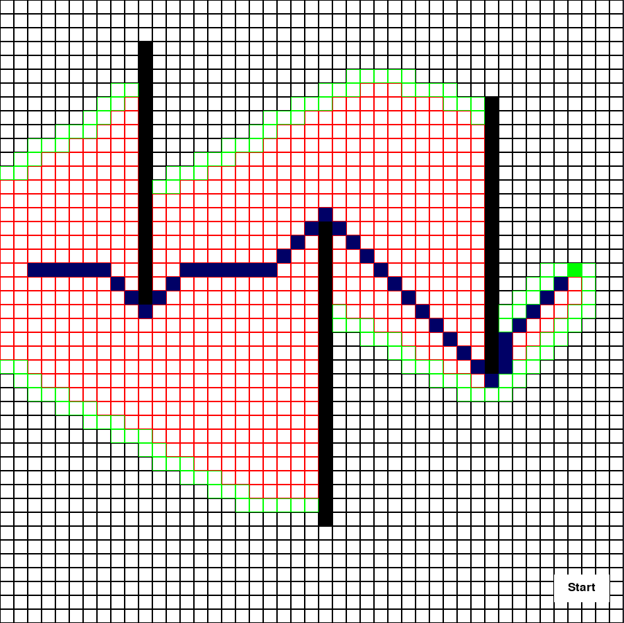

# A* Pathfinding Algorithm Visualization
  This is my first A* algorithm implementation made in python and pygame. Suggestions are higly recommended

# Installation:
```bash
 pip install -r requirements.txt
 # or
 pip3 install -r requirements.txt
 # depending on pip version
```

# Usage
  RIGHT CLICK : set wall<br/>
  HOLD LEFT CLICK + S : set the start node<br/>
  HOLD LEFT CLICK + E : set the end node <br/>
  HOLD LEFT CLICK + D : delete a wall<br/>
  C : clear grid<br/>
  START BUTTON : to start the algorithm<br/>
  Note that each the walls, start point and end point can overwrite other cells, so be carefull to select different cells (this will be correct as soon as possible).

  
